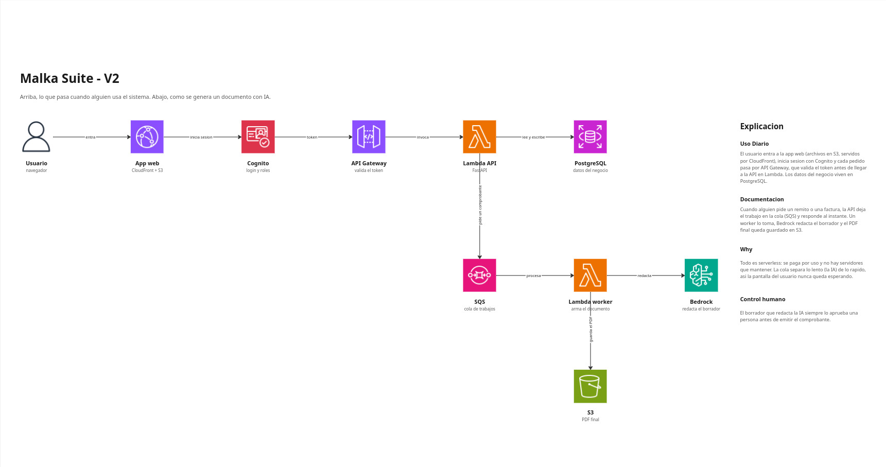
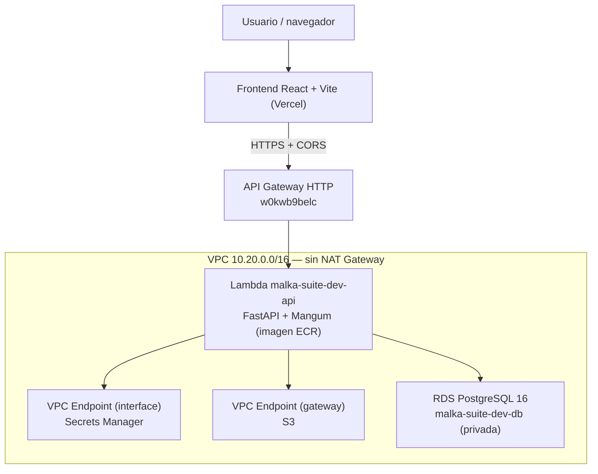

# Malka Suite — Backend

API serverless de **Malka Suite**, el Trabajo Práctico Integrador de Cloud Computing (UTN FRLP).
Stack: **FastAPI** sobre **AWS Lambda** (imagen de contenedor), expuesta por **API Gateway HTTP**, con **PostgreSQL en RDS** dentro de una VPC privada. Toda la infraestructura está descrita en **Terraform**.

| | |
|---|---|
| API (dev) | `https://w0kwb9belc.execute-api.us-east-1.amazonaws.com` |
| Cuenta AWS | `961868442562` |
| Región | `us-east-1` |
| Prefijo de recursos | `malka-suite-dev` |
| Frontend | [frontend-malka](https://github.com/Reinas-Malka/frontend-malka) (React + Vite + TS) |

---

## De qué va el proyecto


Malka Suite es una plataforma SaaS para criaderos de abejas reinas. El caso piloto es la Cabaña Apícola Malka, en la zona rural de La Plata.

La cría de reinas es una producción encadenada y a contrarreloj: cada tanda pasa por el traslarve, las iniciadoras, las continuadoras y el parque de fecundación o el banco de reinas, con fechas que no se pueden correr. Hoy ese ciclo se registra en pizarras y cuadernos, las reservas se comprometen sin saber cuánto va a poder entregar la producción y la facturación se arma a mano.

Malka Suite unifica en un solo sistema:

- **Producción y trazabilidad**: el ciclo de cada tanda etapa por etapa, con porcentajes de aceptación, material consumido y ocupación de los bancos.
- **Ventas nacionales y de exportación**: pedidos y reservas que se descuentan de la disponibilidad real de la producción.
- **Agente de facturación con IA**: redacta borradores de facturas, remitos y documentación aduanera que una persona revisa y aprueba antes de emitir.

Es multi-tenant: cada criadero es un inquilino con sus datos aislados. Los usuarios son el dueño o administrador, el capataz de criadores y el equipo de administración y ventas.

> En el Checkpoint 1 el backend tiene la infraestructura base y los endpoints de salud. Los módulos de negocio se construyen sobre esta base (ver [Estado del Checkpoint 1](#estado-del-checkpoint-1)).

---

## Arquitectura





Decisiones de diseño y sus alternativas descartadas: ver [`docs/adr/`](docs/adr) y [`AI-DECISIONS.md`](AI-DECISIONS.md).

### Principios que sostienen el diseño

1. **Nada de la aplicación es público salvo el API Gateway.** La Lambda corre en subredes privadas y la base no tiene acceso público.
2. **Sin NAT Gateway.** El acceso a servicios de AWS se hace por VPC endpoints, que cuestan una fracción de un NAT.
3. **Sin credenciales en el repositorio.** La contraseña de la base la genera Terraform y vive en Secrets Manager.
4. **Todo por Terraform.** No se crean recursos a mano desde la consola; `terraform plan` sobre `main` debe dar `No changes`.

---

## Servicios utilizados

| Servicio | Recurso | Para qué |
|---|---|---|
| API Gateway HTTP | `w0kwb9belc` | Entrada pública, ruteo y respuesta del preflight CORS |
| Lambda | `malka-suite-dev-api` | Ejecuta FastAPI a partir de una imagen de contenedor |
| ECR | `malka-suite-dev-backend` | Registro de la imagen, con lifecycle policy |
| VPC | `vpc-0499544bc014ded68` | Aislamiento de red (10.20.0.0/16) |
| Subredes privadas | `subnet-0f13096…` (1a), `subnet-0018ca9…` (1b) | Dos AZ, requisito del subnet group de RDS |
| Security Groups | lambda `sg-051b948…`, rds `sg-0d2447c…`, endpoints `sg-0865159…` | Acceso a la base solo desde el SG de la Lambda |
| VPC Endpoints | S3 (gateway) `vpce-0b20ead…`, Secrets Manager (interface) `vpce-0b7d2f4…` | Salida a AWS sin NAT |
| RDS PostgreSQL 16 | `malka-suite-dev-db` (db.t4g.micro) | Base de datos, privada y solo TLS |
| Secrets Manager | `malka-suite-dev/db/owner` | Credenciales de la base |
| CloudWatch Logs | `/aws/lambda/malka-suite-dev-api` | Logs de la API |
| S3 | `malka-suite-tfstate-961868442562` | Estado remoto de Terraform |

### Costos

El proyecto vive dentro del **plan gratuito nuevo de AWS**, con dos consecuencias que condicionaron el diseño: la retención de backups de RDS está limitada a 1 día y no se permite el autoscaling de almacenamiento.

El costo fijo son los **VPC endpoints de interface: ~7,30 USD/mes cada uno**. Hoy Secrets Manager, más SQS y bedrock-runtime desde el worker del #37 (~22 USD/mes en total). Es el precio de no tener un NAT Gateway, que costaría unas cinco veces más. Lambda, API Gateway, RDS `db.t4g.micro` y ECR se mantienen dentro de los límites gratuitos para el volumen de este TP.

---

## Observabilidad

| Qué | Dónde | Detalle |
|---|---|---|
| Logs de la API | CloudWatch `/aws/lambda/malka-suite-dev-api` | Retención de 14 días. El grupo se declara en Terraform; si no, guardaría los logs para siempre |
| Logs del worker | CloudWatch `/aws/lambda/malka-suite-dev-worker` | Retención de 14 días, mismo criterio que la API |
| Trazas | AWS X-Ray | Tracing activo en la Lambda |
| Logs de la base | CloudWatch, exportados desde RDS | Incluye toda consulta que tarde más de 500 ms |
| Prueba de vida | `GET /health` | Usada por el monitoreo y el smoke test |
| Límite de tráfico | API Gateway | 20 requests por segundo, ráfagas de hasta 50 |

---

## Endpoints

| Método | Ruta | Descripción |
|---|---|---|
| GET | `/health` | Liveness. Devuelve estado, versión, entorno y timestamp. |
| GET | `/health/ready` | Readiness. Pensado para verificar dependencias (la verificación real contra la base queda pendiente). |

```bash
curl -s https://w0kwb9belc.execute-api.us-east-1.amazonaws.com/health
# {"estado":"ok","version":"latest","entorno":"dev","momento":"..."}
```

### CORS

El preflight lo responde **API Gateway**, no FastAPI. La aplicación no incluye `CORSMiddleware` a propósito: si lo hiciera, los headers vendrían duplicados. Los orígenes habilitados se controlan con la variable `origenes_permitidos` (por defecto `http://localhost:5173` y `http://127.0.0.1:5173`).

```bash
curl -i -X OPTIONS https://w0kwb9belc.execute-api.us-east-1.amazonaws.com/health \
  -H "Origin: http://localhost:5173" -H "Access-Control-Request-Method: GET"
# HTTP/2 204 + access-control-allow-origin + access-control-max-age: 3600
```

**Limitación conocida:** los previews de Vercel generan un subdominio distinto en cada deploy, así que una lista de orígenes exactos no los cubre. Se resuelve en el Checkpoint 2 con un dominio fijo.

---

## Estructura del proyecto

```
app/
├── main.py              # Aplicación FastAPI y handler que invoca Lambda
└── worker.py            # Handler que consume las colas SQS
infra/
├── versions.tf          # Versiones de Terraform y providers; estado remoto en S3
├── main.tf              # Prefijo común de nombres, zonas y ARNs del modelo de Bedrock
├── variables.tf         # Variables generales del proyecto
├── network.tf           # VPC, subredes, security groups y VPC endpoints
├── rds.tf               # PostgreSQL, credenciales en Secrets Manager y su endpoint
├── ecr.tf               # Repositorio de imágenes y lifecycle policy
├── compute.tf           # Lambda de API, rol IAM y grupo de logs
├── api.tf               # API Gateway: rutas, CORS y límites de tráfico
├── sqs.tf               # Colas con DLQ, Lambda worker y alarmas de DLQ
├── outputs.tf           # Valores que se consultan después del apply
└── backend.hcl.example  # Plantilla del backend de estado
docs/
├── adr/                 # Decisiones de arquitectura
├── arquitectura.jpg     # Diagrama cloud
└── arquitectura.pdf
tests/                   # Pruebas automatizadas
Dockerfile               # Imagen de Lambda con Python 3.12
requirements.txt         # Dependencias de la API
AI-DECISIONS.md          # Registro de decisiones asistidas por IA
```


La API se escribe como una aplicación FastAPI común. Al final de `app/main.py`, Mangum la envuelve en `handler`, que es la función que Lambda invoca en cada request: traduce el evento que manda API Gateway a una request que FastAPI entiende. Por eso el mismo código corre igual en local con Uvicorn y en AWS.

---

## Desarrollo local

Requisitos: Python 3.12, Docker, Terraform 1.10+, AWS CLI con el perfil `malka`.

```bash
python -m venv .venv

# Linux / macOS
source .venv/bin/activate

# Git Bash en Windows
source .venv/Scripts/activate

# Windows (PowerShell)
.venv\Scripts\Activate.ps1

pip install -r requirements-dev.txt 
uvicorn app.main:app --reload
# http://127.0.0.1:8000/health
# http://127.0.0.1:8000/docs  (documentación interactiva de FastAPI, solo en local)
```

Uvicorn no está en `requirements.txt` porque en AWS no se usa: allá la API la ejecuta Lambda a través de Mangum. Dejarlo afuera mantiene la imagen más liviana.

El frontend solo necesita `VITE_API_BASE_URL` apuntando a la URL de la API. **No necesita credenciales de AWS**: todo lo que empieza con `VITE_` queda expuesto en el bundle del navegador.


### Variables de entorno de la API

| Variable | Descripción | Valor por defecto |
|---|---|---|
| `APP_ENVIRONMENT` | Ambiente en el que corre la API | `dev` |
| `APP_VERSION` | Versión que informa el endpoint `/health` | `0.1.0` |
| `COLA_DOCUMENTOS_URL` | URL de la cola SQS de documentos (la carga Terraform) | — |
| `COLA_INGESTA_URL` | URL de la cola SQS de ingesta (la carga Terraform) | — |

En local no hace falta definirlas. En AWS las carga Terraform en la Lambda: `APP_VERSION` toma el valor de la variable `image_tag`.

---

## Despliegue

> Los comandos de esta sección están escritos para bash (Linux, macOS o Git Bash). En PowerShell, `export AWS_PROFILE=malka` se escribe `$env:AWS_PROFILE = "malka"`, y los comandos cortados con `\` se escriben en una sola línea.

### 1. Imagen de contenedor

Lambda rechaza las imágenes que traen attestations, por eso los dos flags:

```bash
aws ecr get-login-password --profile malka --region us-east-1 \
  | docker login --username AWS --password-stdin 961868442562.dkr.ecr.us-east-1.amazonaws.com

docker build --provenance=false --sbom=false -t malka-suite-dev-backend:$(git rev-parse --short HEAD) .
docker tag  malka-suite-dev-backend:$(git rev-parse --short HEAD) \
  961868442562.dkr.ecr.us-east-1.amazonaws.com/malka-suite-dev-backend:$(git rev-parse --short HEAD)
docker push 961868442562.dkr.ecr.us-east-1.amazonaws.com/malka-suite-dev-backend:$(git rev-parse --short HEAD)
```

### 2. Infraestructura

El backend de estado se configura con `backend.hcl`, que **no está versionado** (ver `infra/backend.hcl.example`).

```bash
export AWS_PROFILE=malka
cd infra
terraform init -backend-config=backend.hcl
terraform plan     # sobre main debe decir: No changes
terraform apply
```

**Reglas de oro del equipo:**

- Aplicar **solo desde una rama que contenga todos los `.tf` ya aplicados**. Si se aplica desde una rama incompleta, el plan propone destruir recursos vivos.
- Si un plan muestra algo en `destroy` que no se pidió explícitamente, **frenar** y revisar.
- Nunca imprimir el contenido del secreto de la base en la terminal.

### Variables de Terraform

| Variable | Para qué sirve |
|---|---|
| `project` / `environment` | Forman el prefijo de todos los recursos (`malka-suite-dev`) |
| `region` | Región de AWS |
| `vpc_cidr` | Rango de direcciones de la VPC |
| `image_tag` | Etiqueta de la imagen de ECR que ejecuta la Lambda |
| `origenes_permitidos` | Orígenes habilitados para CORS |
| `habilitar_endpoints_interfaz` | Crea los VPC endpoints de SQS y bedrock-runtime (prendidos desde el #37: el worker corre en la VPC y no tiene NAT) |
| `habilitar_endpoint_secretos` | Crea el VPC endpoint de Secrets Manager |
| `db_clase_instancia` | Clase de la instancia de RDS |

### Salidas útiles

Se consultan desde `infra/` con `terraform output <nombre>`:

| Salida | Para qué sirve |
|---|---|
| `api_base_url` | URL pública de la API; va en `VITE_API_BASE_URL` del frontend |
| `health_url` | URL de la prueba de vida |
| `ecr_repository_url` | Repositorio donde se suben las imágenes |
| `lambda_api_nombre` | Nombre de la función, para buscar sus logs |
| `db_secret_nombre` | Nombre del secreto con las credenciales de la base |

---

## Convenciones

- **Ramas:** `feat/…`, `fix/…`, `docs/…`, `ci/…`, siempre partiendo de `main`.
- **Commits:** Conventional Commits en español (`feat(api): …`, `docs: …`).
- **Pull requests:** uno por issue, con descripción de qué hace y cómo se verificó. Requieren **1 aprobación** y se integran con **Create a merge commit** (nunca squash: rompe las cadenas de ramas y obliga a re-sincronizar los PRs siguientes).
- **`main` protegida** por el ruleset `proteger-main`, que además invalida las aprobaciones cuando se pushean commits nuevos.
- **Tablero:** [Malka Suite — Checkpoint 1](https://github.com/orgs/Reinas-Malka/projects/1), con WIP límite 3 en *In Progress* y en *In Review*.

---

### Pendientes conocidos

- `/health/ready` todavía no consulta la base: responde OK sin verificar dependencias.
- `APP_VERSION` está fijo en `"latest"`; debe pasar a ser el SHA del commit cuando exista el pipeline (#9, #10).
- Sin CI: hoy el build de la imagen y el `terraform apply` se hacen desde la máquina local.

---

## Problemas comunes

**`uvicorn: command not found`**

Uvicorn no está en `requirements.txt`. Instalarlo con `pip install uvicorn` dentro del entorno virtual.

**PowerShell no deja activar el entorno virtual**

Si aparece un error de que la ejecución de scripts está deshabilitada, habilitarla solo para tu usuario y volver a activar el entorno:

```powershell
Set-ExecutionPolicy -Scope CurrentUser RemoteSigned
.venv\Scripts\Activate.ps1
```

**El frontend muestra `blocked by CORS policy`**

El origen del frontend no está en `origenes_permitidos`. Agregarlo y ejecutar `terraform apply`. No agregar `CORSMiddleware` en FastAPI.

**Al crear la Lambda, Terraform dice que la imagen no existe**

La Lambda corre una imagen de ECR, así que el repositorio tiene que tener al menos una imagen antes de crear la función. Subir la imagen primero (ver [Despliegue](#despliegue)).

**Lambda rechaza la imagen**

La imagen se construyó con attestations. Construirla con `--provenance=false --sbom=false`.

**`terraform init` falla al acceder al estado**

Falta `infra/backend.hcl` o el perfil de AWS no es `malka`. Verificar con `aws sts get-caller-identity --profile malka`.

---

## Repositorios

| Repo | Contenido |
|---|---|
| [backend-malka](https://github.com/Reinas-Malka/backend-malka) | API FastAPI, infraestructura Terraform, documentación |
| [frontend-malka](https://github.com/Reinas-Malka/frontend-malka) | Aplicación React + Vite + TypeScript |

El motivo de tener dos repositorios está documentado en [`docs/adr/0004-dos-repositorios.md`](docs/adr/0004-dos-repositorios.md).

## IA: modelo y costos

- Modelo: `us.anthropic.claude-haiku-4-5-20251001-v1:0` (inference profile, us-east-1).
- Verificado el 29/09/2026: `converse` OK (`end_turn`, 13 tokens in / 4 out, 654 ms).
- Precio: 1,00 USD por millón de tokens de entrada, 5,00 por millón de salida.
- Por 1000 tokens: 0,001 USD de entrada y 0,005 USD de salida.
- Plan B: Sonnet 4.5. Opus descartado por costo.
- `claude-3-5-haiku-20241022` está EOL: devuelve ResourceNotFoundException.
- El plan gratuito de AWS no bloquea Bedrock (riesgo del CP2 descartado).

## Costo fijo de infraestructura

- Cada VPC endpoint de interface: ~7,30 USD/mes.
- Hoy solo Secrets Manager. Con SQS + bedrock-runtime pasa a ~22 USD/mes.
- El endpoint de S3 es gateway: sin costo fijo.
